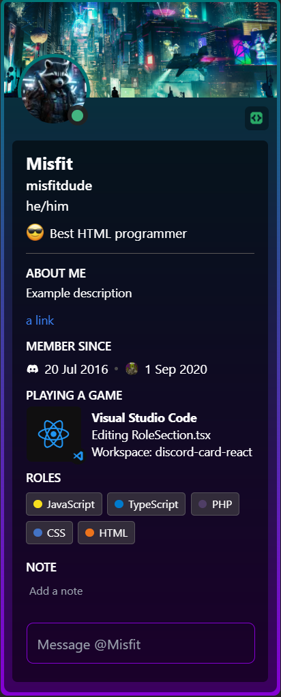

# discord-card-react

A React Component that renders a Discord profile card. Can sync with your Discord status in real time.

<p align="center">
  
</p>

## Features:

- 😀 Easy to use
- 📄 Supports all the features that the real Discord card supports (color gradient, badges, Spotify, and more)
- ⚙️ Highly modular and customizable
- 🏷️ Integrates with [Lanyard](https://github.com/Phineas/lanyard) to sync your _real_ Discord status with this component
- ♿ Accessible
- 🌐 I18n friendly (can translate it to any language)

## How to use

**Requires NodeJS 18 or newer.**

Install the package with your package manager of choice. Example:

`npm install discord-card-react`

Import the card you want to use and the styles:

```
// Static card, doesn't sync with your real Discord status
import { DiscordCard } from "discord-card-react";

// or

// Dynamic card, uses Lanyard to sync with your Discord status
import { LanyardDiscordCard } from "discord-card-react";

// DON'T FORGET TO ADD THE STYLES OR THE CARD WILL LOOK UGLY!
import "discord-card-react/styles";
```

After importing, copy one of the templates below to add the card(s).

## Static Card (\<DiscordCard\>)

Pass props to it to customize. Like the name says, it's static and doesn't update dynamically based on your real Discord status. If you want to add a dynamic card that updates with your status, check the next template below.

```js
<DiscordCard
  // Your Discord profile picture and banner
  imageUrl="profilepicture.webp"
  bannerUrl="banner.png"
  // Colors for the background gradient
  primaryColor="#007777"
  accentColor="#8500d3"
  // Discord connection status (online, idle, dnd, offline)
  connectionStatus="idle"
  basicInfo={{
    displayname: "User",
    username: "username",
    // Pronouns are optional
    pronouns: "he/him",
    }}

  // All these are optional
  badges={[{ name: "Active Developer", iconUrl: "developer-badge.png" }]}
  status={{
    status: "Best HTML Programmer",
    // This is a custom image (the emoji in the status)
    iconUrl: "raccoon.svg",
  }}
  aboutMe={{
    items: [
      {
        text: "You can add as many paragraphs as you want",
      },
      {
        text: "You can also add extra margin at the bottom",
        marginBottom: 8,
      },
      {
        href: "https://example.com",
        text: "Links also work",
      },
      {
        text: "Extra paragraph.",
      },
    ],
  }}
  memberSince={{
    // Only discordJoinDate is required
    discordJoinDate: "20 Jul 2016",
    title: "You can add alternative titles to all sections that have titles",
    serverJoinDate: "1 Sep 2020",
    serverIconUrl: "https://asdasd.com/icon.png",
    serverName: "This is used as the alt attribute for the image, for accessibility"
  }}
  roles={{
    roles: [
      { name: "JavaScript", color: "#f7df1e" },
      { name: "TypeScript", color: "#007acc" },
      { name: "PHP", color: "#4f3e66" },
      { name: "CSS", color: "#4372c4" },
      { name: "HTML", color: "#ed731c" },
    ],
  }}
  note={{
    // Pass parent component's state and input handler to this to retrieve the note
    note: note,
    handleInput: handleNoteChange,
  }}
  message={{
    // Pass parent component's state and input handler to this to retrieve the message
    message: message,
    handleInput: handleMessageChange,
    placeholder: "Message @User",
    accentColor: "#8500d3",
  }}
  // See how it looks below
  spotify={{
    song: "Last Caress",
    artist: "Misfits",
    album: "Collection 2",
    albumImageUrl: "https://i.scdn.co/image/ab67616d0000b273f52e94692944d40e7faf3c81",
    trackUrl: "https://spotify.com/track/182317238712"
  }}
  // See how it looks below
  game={{
    name: "Fortnite",
    details: "Battle Royale - In Lobby",
    state: "Playing Duo",
    largeImage: "fortnitebg.png",
    smallImage: "battlepass.png",
    party: {
      currentSize: 1,
      maxSize: 2,
    }
  }}
></DiscordCard>
```

### Spotify preview


### Game preview


## Lanyard Card (\<LanyardDiscordCard\>)

Pass your Discord ID as a prop to automatically update the card's status and Spotify/Game sections using [Lanyard](https://github.com/Phineas/lanyard) in WebSocket mode.

Make sure to set up Lanyard by following [the instructions](https://github.com/Phineas/lanyard) (joining the Lanyard Discord server), or by self-hosting your own instance by following the instructions provided.

```js
<LanyardDiscordCard
  // Your Discord user ID (used for Lanyard)
  userId="your-discord-id"
  // Optional: Domain that points at your self-hosted Lanyard instance
  // apiUrl="your.lanyard.domain"
  // Your Discord profile picture and banner
  imageUrl="profilepicture.webp"
  bannerUrl="banner.png"
  // Colors for the background gradient
  primaryColor="#007777"
  accentColor="#8500d3"
  basicInfo={{
    displayname: "User",
    username: "username",
    // Pronouns are optional
    pronouns: "he/him",
  }}

  // All these are optional
  badges={[{ name: "Active Developer", iconUrl: "developer-badge.png" }]}
  status={{
    status: "Hello!",
    // This is a custom image (the emoji in the status)
    iconUrl: "statusIcon.svg",
  }}
  aboutMe={{
    items: [
      {
        text: "You can add multiple paragraphs",
      },
      {
        text: "You can add extra margin at the bottom",
        marginBottom: 8,
      },
      {
        href: "https://www.youtube.com/watch?v=NN1OtIJu_Bk",
        text: "Links work as well",
      },
    ],
  }}
  memberSince={{
    // Only discordJoinDate is required
    discordJoinDate: "20 Jul 2016",
    title: "You can add alternative titles to all sections that have titles",
    serverJoinDate: "1 Sep 2020",
    serverIconUrl: "https://asdasd.com/icon.png",
    serverName: "This is used as the alt attribute for the image, for accessibility"
  }}
  roles={{
    roles: [
      { name: "JavaScript", color: "#f7df1e" },
      { name: "TypeScript", color: "#007acc" },
      { name: "PHP", color: "#4f3e66" },
      { name: "CSS", color: "#4372c4" },
      { name: "HTML", color: "#ed731c" },
    ],
  }}
  note={{
    // Pass parent component's state and input handler to this to retrieve the note
    note: note,
    handleInput: handleNoteChange,
  }}
  message={{
    // Pass parent component's state and input handler to this to retrieve the message
    message: message,
    handleInput: handleMessageChange,
    placeholder: "Message @User",
    accentColor: "#8500d3",
  }}
  // You can change the Spotify and Activity (game) section with these optional props
  gameTitle="Playing a game"
  spotifyTitle="Listening on Spotify"
  // Change these to false to disable them
  showSpotify={true}
  showGames={true}
  // If priority is set to "none", both Spotify and Game cards will be displayed
  // If set to "default", the Game card will be given priority over the Spotify card 
  // (this is default Discord behavior)
  // If set to "game", the behavior is the same as default
  // If set to "spotify", the Spotify card will be given priority over the Game card
  priority="none"
></LanyardDiscordCard>
```

## State and input handler example

This is an example on how to implement basic state and input handling for the message and note fields, so you can retrieve its value.

```js
const [note, setNote] = useState("");
const [message, setMessage] = useState("");

function handleNoteChange(event) {
  setNote(event.target.value);
}

function handleMessageChange(event) {
  setMessage(event.target.value);
}

<DiscordCard
// Your card here...
note={{
  // The state and input handler
  note: note,
  handleInput: handleNoteChange,
}}
message={{
  // The state and input handler
  message: message,
  handleInput: handleMessageChange,
}}
// Rest of the card...
></DiscordCard>
```

## Translations (i18n)

You can translate all the sections that have titles by passing a `title` prop. (**About Me, Member Since, Playing a Game, Listening to Spotify, Roles, Note**). This will override the default title.

For example, translating the Member Since section to Spanish:

```js
memberSince={{
  // Only discordJoinDate is required
  discordJoinDate: "20 Jul 2016",
  title: "Miembro desde",
  serverJoinDate: "1 Sep 2020",
  serverIconUrl: "https://asdasd.com/icon.png",
  serverName: "Servidor X"
}}
```


## Credits

Uses [react-use-lanyard](https://www.npmjs.com/package/react-use-lanyard).
